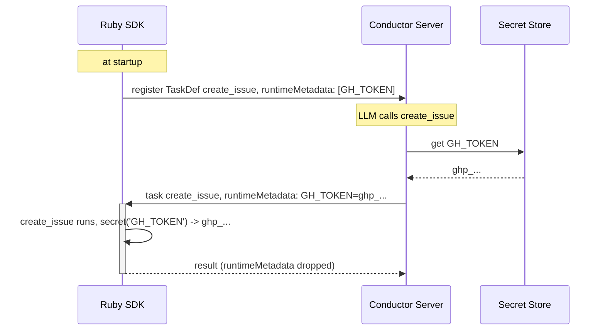

# Secrets

Three kinds. Three different owners. None of them live in your code.

| Secret | Held by | You write |
|---|---|---|
| Conductor auth | your env | `CONDUCTOR_AUTH_KEY`, `CONDUCTOR_AUTH_SECRET` (existing `Configuration`; the token is cached per instance) |
| LLM provider key | Conductor server, as an Integration | `model: 'openai/gpt-4o'` |
| Tool credential | Conductor server, in the secret store | `secret('GH_TOKEN')` in the tool body |

## Tool credentials

```ruby
tool def create_issue(title: String, body: '')
  Github.create_issue(title, body, token: secret('GH_TOKEN'))
end
```

`secret('GH_TOKEN')` is both the read and the declaration. At `tool def` the SDK scans the
method body for literal `secret('...')` and `secrets_env('...')` names and puts them on the
tool's contract: `TaskDef.runtimeMetadata` (names) when the worker registers, and
`tool.config.credentials` in the `agentConfig`. The server resolves the values from its secret
store when your worker polls and attaches them to the task (`Task.runtimeMetadata`, wire-only,
never persisted). Inside the tool, `secret()` reads that map through the task context.

Store the value once on the server: Orkes UI or `SecretClient#put_secret`; on OSS,
`CONDUCTOR_SECRET_GH_TOKEN` in the server's environment.



## When the name is not a literal

```ruby
filer.add_tool :create_issue, credentials: ['GH_TOKEN']   # this tool
tool_credentials :create_issue, 'GH_TOKEN'                # same, at definition time
filer = Agent.new(..., credentials: ['GH_TOKEN'])         # everything under this agent
```

## Subprocesses

Workers are threads in one process, so the SDK never writes `ENV` (that would leak the secret
into every other tool running at the same time). For `system` / `spawn` / `Open3`:

```ruby
tool def gh_create_issue(title: String)
  system(secrets_env('GH_TOKEN'), 'gh', 'issue', 'create', '--title', title)
end
```

`secrets_env('GH_TOKEN')` is `{ 'GH_TOKEN' => 'ghp_...' }` for this call and declares the same
way.

## No secret store on the server?

`secret('X')` falls back to `ENV['X']`, then raises `CredentialNotFoundError` (the task fails
terminally with a message naming the key). Servers older than conductor-oss 3.32.0-rc.8 do
not send `runtimeMetadata`; the ENV fallback keeps tools working there.
