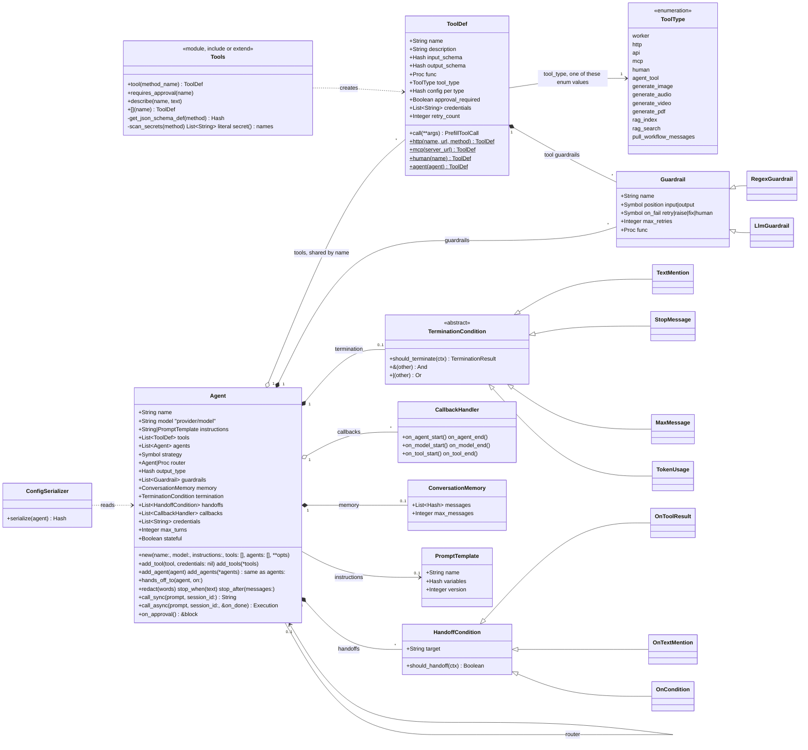
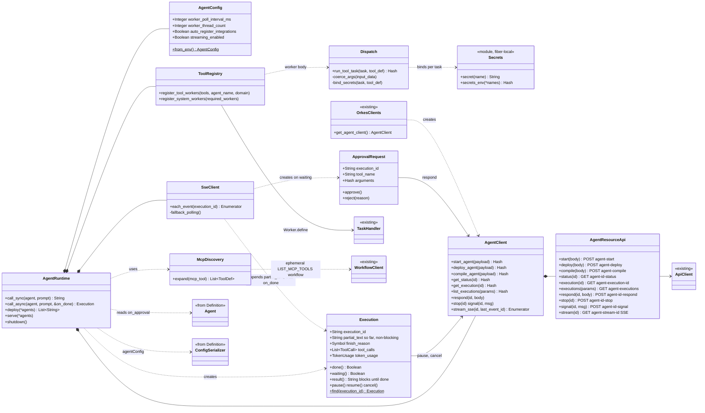
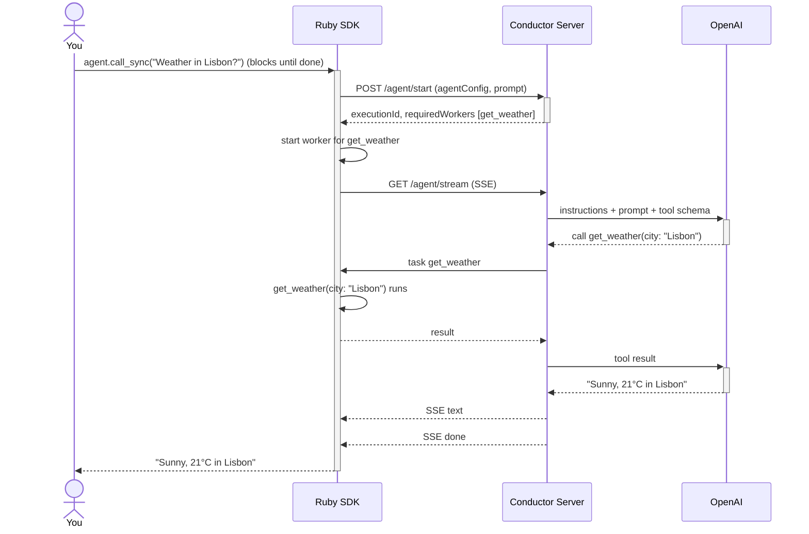
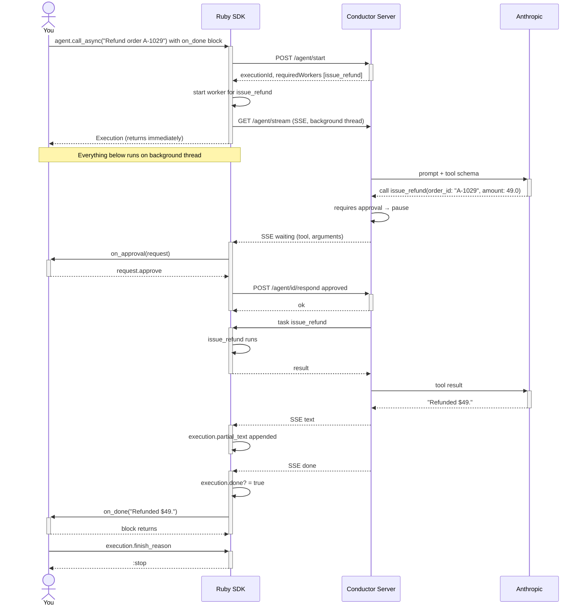
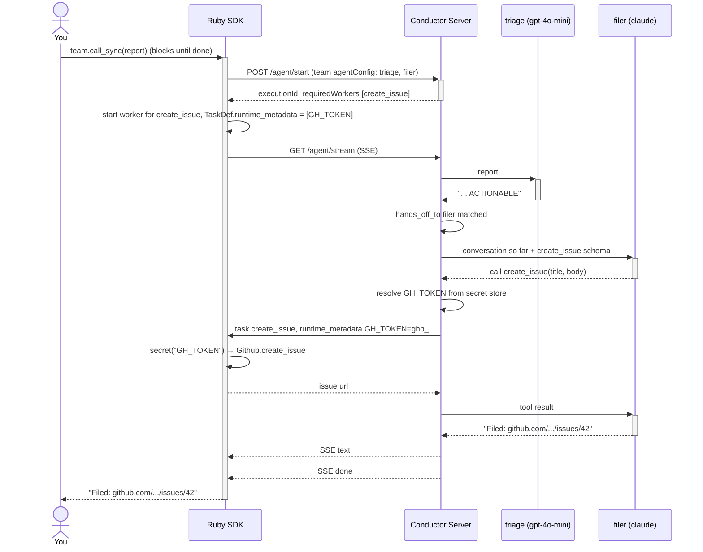
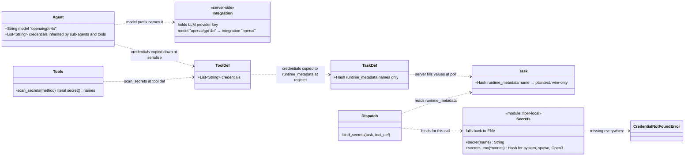
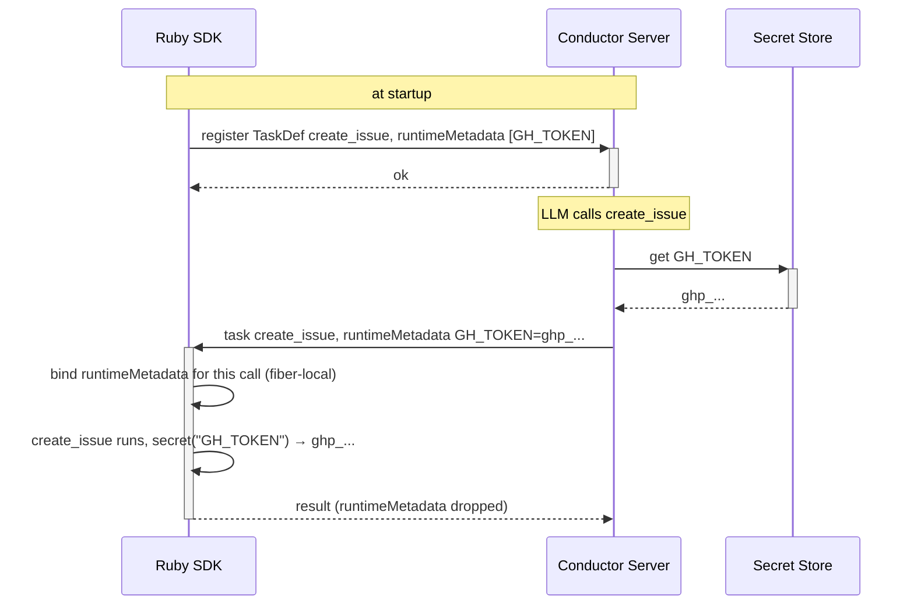

# Ruby Agents Parity Plan

Port `python-sdk/src/conductor/ai/agents` → `conductor_ruby` as `Conductor::Agents`. Same `agentConfig` on the wire; server compiles, SDK serializes + runs workers.

## Classes

### Definition (serialized to agentConfig)



### Runtime + transport



## Examples

### 1. Tools

```ruby
require 'conductor/agents'
include Conductor::Agents

tool def get_weather(city: String, units: 'metric')
  { temp_c: 21.0, summary: "Sunny in #{city}" }
end

agent = Agent.new(
  name: 'weather',
  model: 'openai/gpt-4o',
  instructions: 'Answer weather questions.'
)
agent.add_tool :get_weather

puts agent.call_sync('Weather in Lisbon?')
```

`tool def` marks a method as a tool. Types come from the keyword defaults: `city: String` = required string, `units: 'metric'` = optional with default. Description = humanized method name (`describe :get_weather, '...'` to override). `RubyLLM::Tool` classes work as-is: `agent.add_tool Weather`. Spec: `docs/design/AGENT_TOOLS_DSL.md`.



### 2. Streaming + approval

```ruby
tool def issue_refund(order_id: String, amount: Float)
  Billing.refund(order_id, amount)
end
requires_approval :issue_refund

agent = Agent.new(
  name: 'support',
  model: 'anthropic/claude-sonnet-4-5',
  instructions: 'Help with orders.'
)
agent.add_tool :issue_refund

agent.on_approval do |request|
  request.amount < 100 ? request.approve : request.reject('Needs a manager')
end

# blocking
answer = agent.call_sync('Refund order A-1029, it arrived broken')

# non-blocking, callback when finished
agent.call_async('Refund order A-1029, it arrived broken') do |answer|
  Mailer.send(customer, answer)
end

# non-blocking, poll it yourself
execution = agent.call_async('Refund order A-1029, it arrived broken')
execution.done?          # false until finished
execution.partial_text   # what has streamed so far
execution.result         # blocks for the answer
execution.finish_reason  # :stop | :rejected
```

`call_sync` blocks and returns the answer. `call_async` returns an `Execution` immediately; SSE runs on a background thread, and the block (if given) runs with the answer when done. Spec: `docs/design/AGENT_STREAMING.md`.



Had `on_approval` called `request.reject`, the server skips the tool and finishes with `finish_reason == :rejected`. Same flow with `call_sync`: the first activation bar simply stays open until done and the answer is the return value.

### 3. Team + secret

```ruby
tool def create_issue(title: String, body: '')
  Github.create_issue(title, body, token: secret('GH_TOKEN'))
end

triage = Agent.new(
  name: 'triage',
  model: 'openai/gpt-4o-mini',
  instructions: 'Read the bug report. Say ACTIONABLE if it should be filed.'
)

filer = Agent.new(
  name: 'filer',
  model: 'anthropic/claude-sonnet-4-5',
  instructions: 'File the bug as a GitHub issue.'
)
filer.add_tool :create_issue

triage.hands_off_to filer, on: 'ACTIONABLE'

team = Agent.new(name: 'bug_desk')
team.add_agent triage
team.add_agent filer

puts team.call_sync(File.read('report.md'))
```

Make the agent, then give it things. `secret('GH_TOKEN')` in the tool body both reads the secret and declares it — the SDK scans for it at `tool def` and the server attaches the value to each task. Optional: `filer.redact %w[password api_key]`, `filer.stop_when 'ISSUE_FILED'`, `filer.stop_after messages: 12`, `team.strategy = :sequential`. Every line is sugar over the Python-parity objects (`Handoff::OnTextMention`, `RegexGuardrail`, `Termination::*`). Spec: `docs/design/AGENT_TEAMS.md`.



## Secrets



| Secret | Held by | You write |
|---|---|---|
| Conductor auth | your env | `CONDUCTOR_AUTH_KEY`, `CONDUCTOR_AUTH_SECRET` (existing `Configuration`, token cache moves to instance level) |
| LLM provider key | server Integration | `model: 'openai/gpt-4o'` — `openai` is the integration name. SDK never sees the key. |
| Tool credential | server secret store | `secret('GH_TOKEN')` in the tool body — read and declaration in one |

### Flow: tool credential



### Use a secret in a tool

```ruby
tool def create_issue(title: String, body: '')
  Github.create_issue(title, body, token: secret('GH_TOKEN'))
end
```

That's it. `secret('GH_TOKEN')` is the read *and* the declaration: at `tool def` the SDK parses the method body, collects every literal `secret('...')`, and puts the names in the tool's contract (`TaskDef.runtimeMetadata`, `tool.config.credentials`). Python makes you write the list; Ruby reads it off the code. Same wire contract.

### When the name isn't a literal

```ruby
filer.add_tool :create_issue, credentials: ['GH_TOKEN']     # this tool
filer = Agent.new(..., credentials: ['GH_TOKEN'])           # everything under this agent
```

### Tool that shells out

```ruby
tool def gh_create_issue(title: String)
  system(secrets_env('GH_TOKEN'), 'gh', 'issue', 'create', '--title', title)
end
```

`secrets_env('GH_TOKEN')` is `{ 'GH_TOKEN' => 'ghp_...' }` for this call, and declares the same way. Ruby's `system` / `spawn` / `Open3` take an env hash as the first argument, so only the child process sees it. We never write to `ENV`.

### No secret store on the server?

`secret('GH_TOKEN')` falls back to `ENV['GH_TOKEN']`.

## Frameworks

No official Ruby SDK exists for any of these. Not supported.

| Framework | Ruby |
|---|---|
| OpenAI Agents SDK | N/A |
| Anthropic Claude Agent SDK | N/A |
| LangGraph | N/A |
| Google ADK | N/A |
