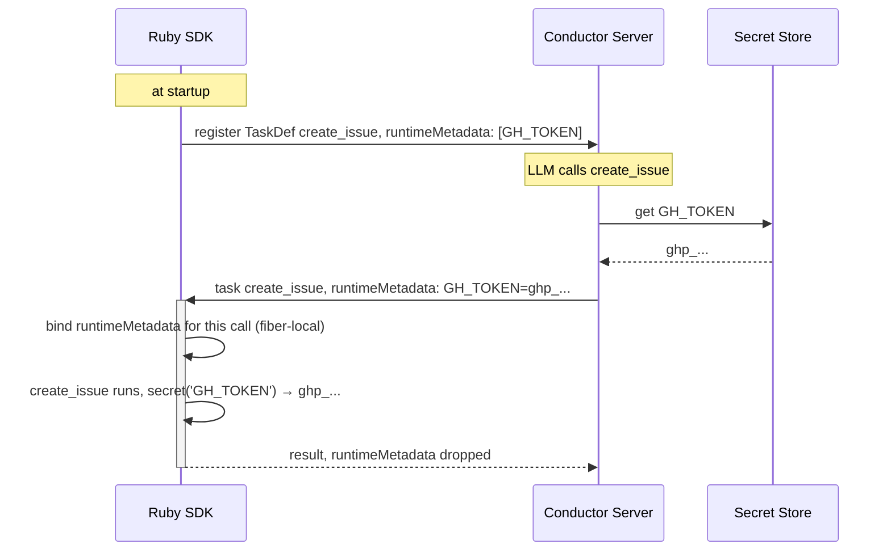

# Secrets

Three kinds. Three different owners. None of them live in your code.

| Secret | Example | Who holds it | You write |
|---|---|---|---|
| Conductor auth | key + secret for the server | your env | `CONDUCTOR_AUTH_KEY`, `CONDUCTOR_AUTH_SECRET` |
| LLM provider key | OpenAI / Anthropic API key | Conductor server, as an Integration | `model: 'openai/gpt-4o'` |
| Tool credential | GitHub token your tool needs | Conductor server, in the secret store | `credentials :create_issue, 'GH_TOKEN'` + `secret('GH_TOKEN')` |

## 1. Conductor auth

```
export CONDUCTOR_SERVER_URL=https://play.orkes.io/api
export CONDUCTOR_AUTH_KEY=...
export CONDUCTOR_AUTH_SECRET=...
```

Existing `Configuration`. Nothing new.

## 2. LLM provider key

```ruby
agent = Agent.new(name: 'weather', model: 'openai/gpt-4o', instructions: '...')
```

`openai` is not a vendor name, it's the **name of an Integration on the server**. Someone
added the OpenAI key there once (UI, or `IntegrationClient#save_integration`). The SDK never
sees the key. Swap `openai/gpt-4o` for `anthropic/claude-sonnet-4-5` and nothing else changes.

Same as Python. Same as the existing `llm_chat` DSL task (`llmProvider`).

## 3. Tool credential

```ruby
tool def create_issue(title: String, body: '')
  Github.create_issue(title, body, token: secret('GH_TOKEN'))
end
```

That's the whole thing. `secret('GH_TOKEN')` in the body is both the read *and* the
declaration. At `tool def`, the SDK parses the method body, finds every `secret('...')` with a
literal name, and puts those names in the tool's contract (`TaskDef.runtimeMetadata`,
`tool.config.credentials`). The server then attaches the values to each task for that tool.

Store the value on the server once: `conductor secrets put GH_TOKEN ghp_...`, or the UI, or
`SecretClient#put_secret`.

When the name isn't a literal, say it when attaching the tool:

```ruby
filer.add_tool :create_issue, credentials: ['GH_TOKEN']
```

### What happens



- Names go up at registration (`TaskDef.runtimeMetadata`). Values come down per task
  (`Task.runtimeMetadata`, wire-only, never persisted with the task).
- `secret('X')` reads the map bound for the current call, else `ENV['X']`, else
  `CredentialNotFoundError`.

Same wire contract as Python's `credentials=[...]` + `get_secret()`. Python makes you write
the list; Ruby reads it off the code.

## The one Ruby difference

Python also injects secrets into `os.environ` for the duration of the call, so shell-out
tools (`gh`, `aws`) can find them. It can do that because Python workers are separate
processes.

Ruby workers are threads in one process. Writing `ENV` from a tool would leak secrets into
every other tool running at the same time. So we don't. For subprocesses:

```ruby
tool def gh_create_issue(title: String)
  system(secrets_env('GH_TOKEN'), 'gh', 'issue', 'create', '--title', title)
end
```

`secrets_env('GH_TOKEN')` returns `{ 'GH_TOKEN' => 'ghp_...' }` for the current call, and
the literal name is picked up as a declaration the same way `secret()` is. Ruby's `system`,
`spawn`, and `Open3` all accept an env hash as the first argument — the child sees it, nobody
else does.

## Explicit declaration

Two cases where the SDK can't read the name off the code:

```ruby
filer.add_tool :create_issue, credentials: ['GH_TOKEN']   # name is dynamic, or method typed in irb

filer = Agent.new(..., credentials: ['GH_TOKEN'])          # grant to every tool + sub-agent under this agent
```

Both add to whatever was detected. Same as Python's `Agent(credentials=[...])`.

## No secret store on the server?

`secret('X')` falls back to `ENV['X']`. Always on.

## Cheat sheet

```ruby
secret('KEY')                              # read — and this alone declares it
secrets_env('KEY_A', 'KEY_B')              # Hash for system / spawn / Open3 — also declares
agent.add_tool :x, credentials: ['KEY']    # explicit, when the name isn't a literal
Agent.new(..., credentials: ['KEY'])       # grant to everything under the agent
# no server value → ENV['KEY'], automatically
```

## Decided

1. `secret('X')` is a bare helper. No `context:` arg.
2. Tool credentials are detected from `secret('LITERAL')` in the tool body at `tool def` (AST scan). Explicit `add_tool ..., credentials:` for dynamic names; agent-level `credentials:` grants to everything under it.
3. `secret('X')` falls back to `ENV['X']` when the server sends nothing. Always on.
4. `Configuration` auth-token cache moves from class level to instance level. Prerequisite.
