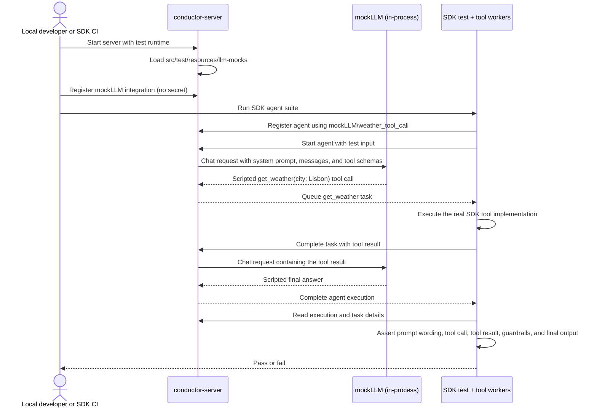
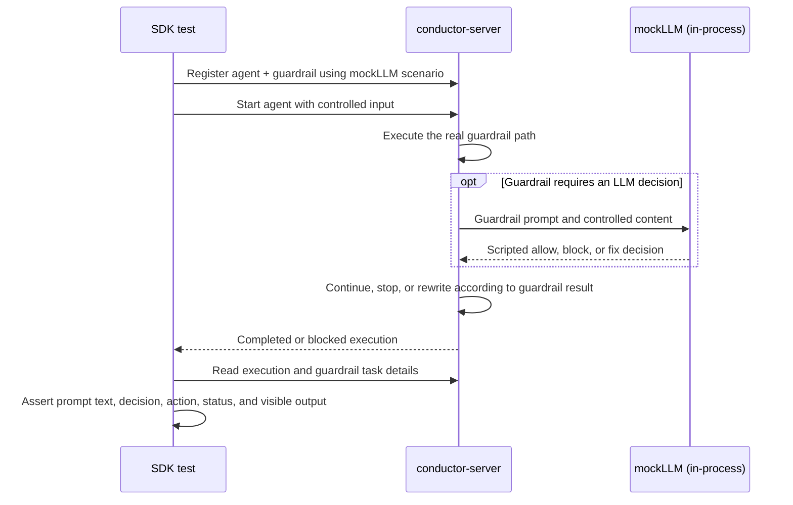

# SDK Agents Testing Strategy V2

> Status: local working draft for rapid iteration. This supersedes the WireMock assumptions in
> the current Confluence draft but does not update Confluence yet.

## Decision

SDK agent tests run against a real Conductor server and a deterministic `mockLLM` provider built
directly into the Conductor OSS test runtime.

There is no WireMock, HTTP recording proxy, replay server, or separate request normalizer. Conductor
OSS owns the small mock provider implementation and its canonical JSON fixtures under
`src/test/resources/llm-mocks/`. Each SDK owns its agent definitions, workers, and assertions.

The server supports two modes over that one fixture format:

- **Replay mode** is the default for SDK development and CI. Agents use `mockLLM/<scenario>`, and
  `mockLLM` validates the provider-neutral request before returning the fixture's response.
- **Record mode** is an explicit local authoring mode. A JVM system property names the scenario,
  and Conductor records the provider-neutral requests and responses from any real integration other
  than `mockLLM` into the canonical fixture.

Local development and CI use the same path:

1. Start `conductor-server` from a pinned Conductor OSS revision with the test runtime enabled.
2. Register the no-secret `mockLLM` integration provider.
3. Register an agent whose model points to a named `mockLLM` scenario.
4. Run the agent through the real Conductor APIs and real task queues.
5. Assert the prompt, tool calls, tool results, guardrail behavior, and final execution result.

Record mode is not part of the normal test run. It exists to create or refresh the single expected
fixture for a scenario, after which that fixture is replayed everywhere through `mockLLM`.

## Goals

- Exercise each SDK against the real Conductor server, agent compiler, execution engine, task
  queues, and persistence layer.
- Make agent tests deterministic, fast, credential-free, and runnable on fork pull requests.
- Verify the exact SDK/server contract: serialized definitions, prompt wording, tool schemas and
  arguments, tool results, guardrail outcomes, and final output.
- Keep the mocking implementation intentionally small and colocated with the server behavior it
  replaces.
- Run identical scenarios locally and in CI.
- Make expected model wording, tool calls, and follow-up turns easy to create from a real provider
  when a scenario is first authored or intentionally refreshed.

## Non-goals

- Testing OpenAI, Anthropic, or another provider's wire protocol.
- Recording or replaying raw provider HTTP traffic.
- Maintaining separate OpenAI, Anthropic, model, or provider-specific mock sets.
- Running record mode in CI.
- Verifying the natural-language quality of a real model response.
- Mocking Conductor's HTTP API, task queue, SSE implementation, or execution engine.
- Using a separate `conductor-mocks` repository for functional-test infrastructure.

## Test layers

### 1. Contract tests: SDK only, no server

Contract tests remain ordinary unit tests. They catch SDK serialization and schema regressions
quickly without booting Conductor.

Each SDK should assert that its agent configuration:

- conforms to the published agent schema;
- serializes into the expected Conductor agent/workflow definition;
- generates the expected tool input schema;
- includes guardrails, secrets, handoffs, and other agent settings in the correct shape.

Ruby example:

```ruby
expect(JSONSchemer.schema(AGENT_SCHEMA).valid?(config)).to be true
expect(ConfigSerializer.serialize(agent)).to eq JSON.parse(fixture('weather_agent.json'))
```

These tests answer: **did the SDK build the correct definition?**

### 2. Functional tests: SDK plus real Conductor plus `mockLLM`

Functional tests boot a real server and exercise an agent end to end. Only the external model is
replaced. The `mockLLM` provider returns deterministic chat responses from a named fixture while all
orchestration remains real.

These tests answer: **does this SDK-defined agent behave correctly when Conductor executes it?**

### 3. Fixture authoring: real provider through Conductor record mode

Record mode runs the same server and SDK scenario with a real, non-`mockLLM` integration. Conductor
captures the request and response after provider-specific translation has been removed from the
equation and writes the canonical fixture consumed by `mockLLM`.

This is a developer workflow, not a test topology or CI dependency. A recorded fixture must be
reviewed and then replayed with `mockLLM` before it is committed.

## Ownership and layout

### Conductor OSS

Conductor OSS owns the provider and the model responses because prompt construction, tool-call
translation, and guardrail orchestration happen in the server.

Proposed layout (the exact module prefix may change during implementation):

```text
conductor-oss/
└── ai/
    └── src/
        └── test/
            ├── java/.../MockLLM.java
            ├── java/.../MockLLMRecorder.java
            └── resources/
                └── llm-mocks/
                    ├── weather_tool_call.json
                    ├── input_guardrail_block.json
                    ├── output_guardrail_fix.json
                    └── team_handoff.json
```

`MockLLM` is a normal Conductor AI model implementation available only in the test runtime. It:

- advertises the provider name `mockLLM`;
- uses the requested model name as the fixture name;
- loads that fixture from `src/test/resources/llm-mocks`;
- finds the single fixture turn whose `expect` block matches the provider-neutral request;
- returns the response through the same Conductor AI model interface as a real provider; and
- performs no network I/O and requires no credentials.

Replay uses request content rather than a global call counter. That keeps concurrent SDK scenarios
isolated and makes a prompt, tool schema, tool call, or tool-result mismatch fail at the relevant
request rather than shifting every later response.

A minimal fixture shape could be:

```json
{
  "schemaVersion": 1,
  "scenario": "weather_tool_call",
  "turns": [
    {
      "expect": {
        "messages": [
          {
            "role": "system",
            "content": "Answer weather questions using the weather tool."
          },
          { "role": "user", "content": "Weather in Lisbon?" }
        ],
        "tools": [
          {
            "name": "get_weather",
            "description": "Get the weather for a city"
          }
        ]
      },
      "respond": {
        "toolCall": {
          "id": "call_weather_1",
          "name": "get_weather",
          "arguments": { "city": "Lisbon", "units": "metric" }
        }
      }
    },
    {
      "expect": {
        "lastMessage": {
          "role": "tool",
          "name": "get_weather",
          "content": { "temp_c": 21.0, "summary": "Sunny in Lisbon" }
        }
      },
      "respond": { "text": "Sunny in Lisbon, 21C." }
    }
  ]
}
```

The fixture is a provider-neutral request/response script, not a capture of an HTTP exchange. It
contains only semantic fields required to validate and drive the Conductor behavior under test.
Provider request envelopes, URLs, headers, authentication, completion IDs, timestamps, token usage,
and provider/model names are never written.

### Record mode in Conductor

Record mode is enabled when Conductor starts. The proposed JVM properties are:

```text
-Dconductor.ai.mock-llm.record=<scenario>
-Dconductor.ai.mock-llm.output-dir=<absolute-path-to-src/test/resources/llm-mocks>
```

The first property enables recording and supplies the canonical scenario name. The output directory
may default to the Conductor OSS test-resource location for a source checkout, but CI and scripts
should pass it explicitly so the destination is unambiguous.

When record mode is enabled, Conductor decorates its normal AI model invocation at the
provider-neutral boundary:

1. The agent must reference a real integration such as OpenAI or Anthropic. Selecting `mockLLM`
   fails immediately because recording a mock would create a mock of a mock.
2. Conductor builds the normal prompt, messages, tool schemas, and guardrail request.
3. The recorder forwards the call to the selected real provider.
4. The recorder retains only the stable `expect` request fields and semantic `respond` fields.
5. Tool calls execute normally. Their results naturally appear in the next recorded request.
6. Each completed turn is written atomically to `<output-dir>/<scenario>.json`.

Recording OpenAI and recording Anthropic both write exactly the same file shape and path. The chosen
provider is merely how a developer generates the desired wording and tool calls. It is not part of
fixture identity, and there is only one supported fixture set.

Record one scenario at a time. Re-recording intentionally replaces that scenario's canonical file;
the resulting source diff is the review surface.

### Each SDK

Each SDK owns:

- the test agent definition written through that SDK's public API;
- any SDK-hosted tool implementation or worker;
- the input used to start the agent;
- assertions over the registered definition and completed execution; and
- a small test helper that starts or connects to the Conductor test server and registers the
  `mockLLM` integration.

SDK tests do not start a mock HTTP service and do not understand the mock fixture internals. A test
selects a scenario only by using a model such as `mockLLM/weather_tool_call`.

## Replay mode: one execution model for local development and CI



This is the only functional-test topology. SSE and polling may both be exercised by SDK tests, but
they are merely two clients of the same real execution; neither needs a separate mock strategy or
sequence diagram.

## Record mode: local fixture authoring

```mermaid
sequenceDiagram
  actor D as Developer
  participant S as SDK scenario + tool workers
  participant C as conductor-server
  participant R as In-process recorder
  participant L as Real non-mockLLM provider

  D->>C: Start with -Dconductor.ai.mock-llm.record=weather_tool_call
  D->>S: Run one SDK scenario using OpenAI or Anthropic integration
  S->>C: Register and start the agent
  C->>R: Provider-neutral prompt, messages, and tool schemas
  R->>L: Invoke the configured real provider
  L-->>R: Generated tool call
  R->>R: Save canonical expect + respond turn
  R-->>C: Return the real provider response
  C-->>S: Queue the generated tool call
  S->>C: Complete the real tool with its result
  C->>R: Next request containing that tool result
  R->>L: Invoke the same configured provider
  L-->>R: Generated final text
  R->>R: Save canonical expect + respond turn atomically
  R-->>C: Return final text
  C-->>S: Complete agent execution
  S-->>D: Scenario result; review the fixture diff

  Note over D,L: Provider-specific HTTP is never recorded.<br/>OpenAI and Anthropic produce the same single fixture format.
```

After recording, restart Conductor without the record property, change the test agent back to
`mockLLM/weather_tool_call`, and run the same scenario in replay mode. The fixture is ready only when
that deterministic replay and the SDK assertions pass.

## Guardrail execution

Guardrails also run in the real server. A scenario supplies deterministic model output only when a
guardrail or the main agent needs an LLM response.



For a blocked input guardrail, the test should also assert that the main agent LLM task and tool task
were never scheduled. For a fixing guardrail, it should assert both the original guardrail decision
and the exact rewritten text passed to the next stage.

## What functional tests assert

Assertions come from Conductor's persisted execution and task data plus observations made by the
SDK tool worker. They must not depend only on the final answer.

For each scenario, assert the applicable items:

1. **Registration**
   - the agent definition registered successfully;
   - the agent references the expected `mockLLM` integration and scenario;
   - generated tool schemas and guardrail configuration match the test.
2. **Prompt construction**
   - system/developer instructions contain the required exact wording;
   - user messages and relevant conversation history appear in the expected order;
   - tool descriptions and schemas exposed to the model are correct;
   - runtime-only values are asserted structurally or by stable substring, not as fixed IDs.
3. **Tool execution**
   - the expected tool is called exactly once unless the scenario says otherwise;
   - arguments match exactly;
   - the SDK worker returns the expected result;
   - that result is present in the next LLM task input.
4. **Guardrails**
   - the expected input/output/tool guardrail runs;
   - its decision and configured action are correct;
   - blocked paths do not execute forbidden downstream work;
   - fixed content, rejection reasons, and final statuses are preserved.
5. **Completion**
   - the execution reaches the expected terminal status;
   - final text and finish reason match the deterministic fixture;
   - no unexpected tool or LLM tasks were scheduled.

Ruby-style example:

```ruby
agent = Agent.new(
  name: 'weather',
  model: 'mockLLM/weather_tool_call',
  instructions: 'Answer weather questions using the weather tool.'
)
agent.add_tool :get_weather

execution = agent.call_async('Weather in Lisbon?')
result = execution.result
details = conductor.workflow_client.get_workflow(execution.execution_id, true)

expect(recorded_tool_calls).to contain_exactly({
  name: 'get_weather',
  arguments: { 'city' => 'Lisbon', 'units' => 'metric' }
})
expect(llm_task(details).input_data.fetch('messages').to_json)
  .to include('Answer weather questions using the weather tool.')
expect(result).to eq('Sunny in Lisbon, 21C.')
```

The final helper names will follow each SDK's existing APIs. The important contract is that tests
inspect the real execution rather than a mock server's request log.

## Initial shared scenario catalog

All SDKs should implement the same small behavioral matrix. The named model fixture in Conductor OSS
drives the response, while each SDK expresses and verifies the scenario through its own public API.

| Scenario | Main behavior under test | Required assertions |
|---|---|---|
| `direct_answer` | Agent completes without a tool | Prompt text, final text, no tool tasks |
| `weather_tool_call` | One SDK tool call followed by an answer | Tool schema, exact args, tool result in next prompt, final text |
| `input_guardrail_block` | Input guardrail prevents execution | Guardrail prompt/result, blocked status, no main LLM/tool task |
| `output_guardrail_fix` | Output guardrail rewrites model text | Original output, fix decision, corrected final output |
| `approval_reject` | Tool call waits for and receives rejection | Pending approval, rejection reason, tool body not run, final status |
| `team_handoff` | One agent hands execution to another | Handoff target, prompts for both agents, final owner and output |

Provider-specific protocol cases do not belong in this suite. Those remain Conductor provider adapter
tests.

## Local workflow

Provide one script or Gradle task in Conductor OSS that starts the test server with `mockLLM` on the
classpath. The SDK test helper should support either starting that command or connecting to an
already-running server.

### Normal replay

```bash
# terminal 1: conductor-oss
./gradlew <test-server-task>

# terminal 2: ruby-sdk
CONDUCTOR_SERVER_URL=http://localhost:8080/api \
bundle exec rspec spec/agents
```

No LLM API key or mock-service URL is set. The SDK helper registers `mockLLM` idempotently before the
suite and waits for the Conductor health endpoint before running tests.

### Create or refresh a fixture

Start the built server with the record properties and configure one real provider integration in
the normal Conductor way:

```bash
java \
  -Dconductor.ai.mock-llm.record=weather_tool_call \
  -Dconductor.ai.mock-llm.output-dir=/path/to/conductor/ai/src/test/resources/llm-mocks \
  -jar conductor-server.jar
```

Then run only the corresponding SDK scenario with its agent temporarily configured for a real
integration:

```bash
CONDUCTOR_SERVER_URL=http://localhost:8080/api \
bundle exec rspec spec/agents/weather_tool_call_spec.rb
```

Review the resulting `weather_tool_call.json`, stop the recording server, and rerun the scenario
against `mockLLM/weather_tool_call`. The recording invocation requires credentials only for the real
integration chosen by the developer.

## CI wiring

Each SDK agent job performs the same operations:

1. Check out the SDK and a pinned Conductor OSS revision.
2. Build and start `conductor-server` with the test runtime and `mockLLM` fixtures.
3. Wait until the server is healthy.
4. Register the `mockLLM` integration.
5. Install the SDK toolchain and run its agent tests against the server.
6. Upload server logs and execution details on failure.

Record mode must not be enabled in CI. CI consumes the committed canonical fixtures and never
configures a real LLM integration or provider credential.

Illustrative workflow:

```yaml
jobs:
  agents:
    runs-on: ubuntu-latest
    steps:
      - uses: actions/checkout@v4
      - uses: actions/checkout@v4
        with:
          repository: conductor-oss/conductor
          ref: <pinned-sha>
          path: conductor-oss
      - run: conductor-oss/gradlew <test-server-task>
      - run: bundle install
      - run: bundle exec rspec spec/agents
        env:
          CONDUCTOR_SERVER_URL: http://localhost:8080/api
```

The final server-start step should run in the background, include a health wait, and guarantee cleanup.
It is shown compactly here because the exact Gradle task is part of the Conductor OSS implementation.

## Failure behavior

Failures should be direct and local:

- an unknown model/scenario fails with the missing fixture path;
- no fixture turn matching the current request fails with a concise summary of message roles and
  available selectors;
- malformed fixture JSON fails server startup or the first scenario use;
- enabling record mode while selecting `mockLLM` fails with an explicit unsupported-operation
  message;
- record mode refuses to mix multiple scenario names into one output file;
- an SDK assertion shows the actual persisted prompt, tool call, guardrail result, or final output;
- an unexpected external provider selection fails because CI has no credentials and only `mockLLM`
  is registered for these tests.

## Removed from the previous design

The following components and concepts are deleted:

- WireMock and its Gradle record/replay modes;
- recorded HTTP mappings and `__files` payloads;
- post-processing raw provider traffic through a request normalizer;
- WireMock scenario state, request logs, and unmatched-request verification;
- `CONDUCTOR_RECORD` and `CONDUCTOR_RECORD_URL`;
- provider/model-specific recording directories;
- a reusable workflow whose primary purpose is to run WireMock; and
- the separate recording lifecycle in `conductor-mocks`.

The replacement is one in-process replay provider, one in-process provider-neutral recorder, a
single set of deterministic JSON fixtures, and ordinary assertions against a real Conductor
execution.

## Implementation slices

1. **Conductor OSS test provider**
   - implement `MockLLM` through the existing AI model interface;
   - load named fixtures from `src/test/resources/llm-mocks`;
   - expose it only in the test server profile/classpath;
   - add provider unit tests for text, tool-call, missing-fixture, and concurrent scenario behavior.
2. **Conductor OSS record mode**
   - add the `conductor.ai.mock-llm.record` and output-directory JVM properties;
   - decorate non-`mockLLM` model calls at the provider-neutral boundary;
   - atomically emit the canonical request/response fixture without provider metadata;
   - reject `mockLLM` as a recording source;
   - test that OpenAI-shaped and Anthropic-shaped adapters produce the same fixture schema.
3. **Conductor OSS test-server entry point**
   - add a documented Gradle/script entry point;
   - make no-secret `mockLLM` integration registration automatic or idempotent;
   - expose a reliable health check.
4. **Ruby SDK first adopter**
   - add the server-backed agent spec helper;
   - implement the initial scenario catalog;
   - assert persisted prompts, tool calls, guardrails, and results;
   - add the agent job to CI.
5. **Other SDKs**
   - reuse the same fixture names and behavioral assertions;
   - implement only the language-specific agent definition, tool worker, and test adapter.

## Acceptance criteria

- The full Ruby agent suite passes locally with no provider credentials.
- The same suite passes in CI against a freshly started real Conductor server.
- No WireMock process, dependency, configuration, or mock repository is involved.
- Starting Conductor with `-Dconductor.ai.mock-llm.record=<scenario>` and a real provider creates or
  refreshes that scenario's canonical fixture.
- Recording the same scenario through OpenAI or Anthropic produces the same provider-neutral schema
  and the same output path; only one version may be committed.
- Record mode rejects `mockLLM`, and CI never enables record mode.
- At least one test proves a real SDK tool is invoked and its result reaches the next LLM turn.
- At least one test proves a guardrail blocks or fixes content and the forbidden path does not run.
- At least one test asserts stable prompt wording from the persisted LLM task input.
- Tests fail clearly when the SDK changes a prompt, tool schema/argument, tool result, or guardrail
  configuration unexpectedly.
- The test server makes zero outbound LLM network calls.
